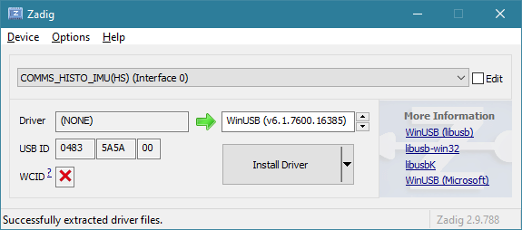
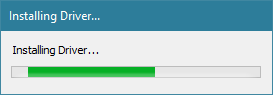
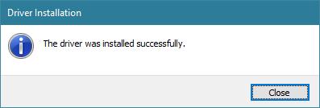
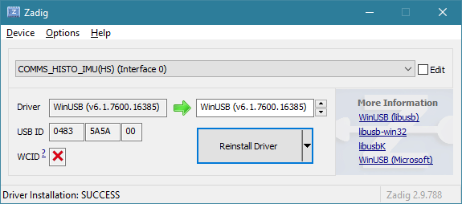
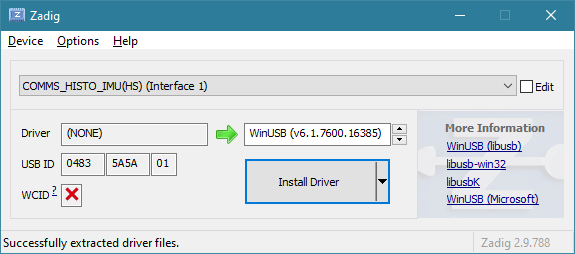

# Openwater Open-Motion Sensor Module v1.0.0
This repository contains the firmware for the Motion Sensor Module.

# Driver Install
This device is a USB composite device with three interfaces and we are required to install the Latest WinUSB Driver for COMMS_HISTO_IMU(HS)

## Driver Utility
For the Host machine to communicate with the sensor module from user-space, each interface must be bound to the Microsoft WinUSB driver provided by Windows 10/11 (latest in-box version).

[Download Zadig](https://zadig.akeo.ie/)

### Associate drivers for COMMS_HISTO_IMU

Connect the Console with Sensor Module(s) attached to your computer.

Run Zadig and select the first interface (two will be listed only need to select one)

Select COMMS_HISTO_IMU(HS) (Interface 0)

Click Install Driver after a little bit you will see success and the driver associated

After successful install you will see that the interface is now associated with WinUSB

Do the same steps for Interface 1 and Interface 2

Once completed close Zadig and you can now run the Open-MOTION software.

TODO:
For Windows to auto-load the latest WinUSB without any INF install, you can add Microsoft OS 2.0 descriptors to your firmware with Compatible ID = WINUSB for each interface. On Win8.1+, it will just bind to the in-box WinUSB automatically.
